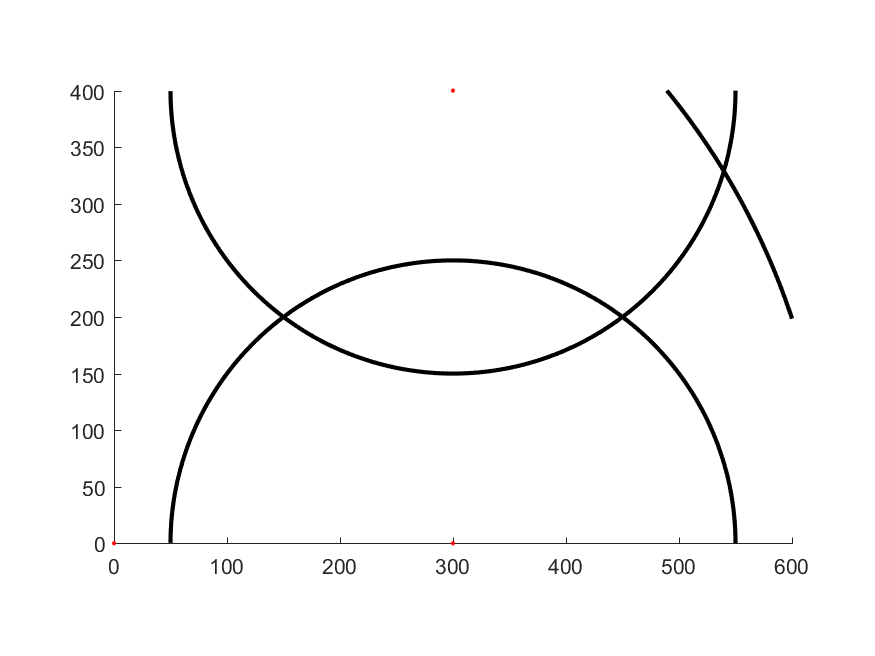
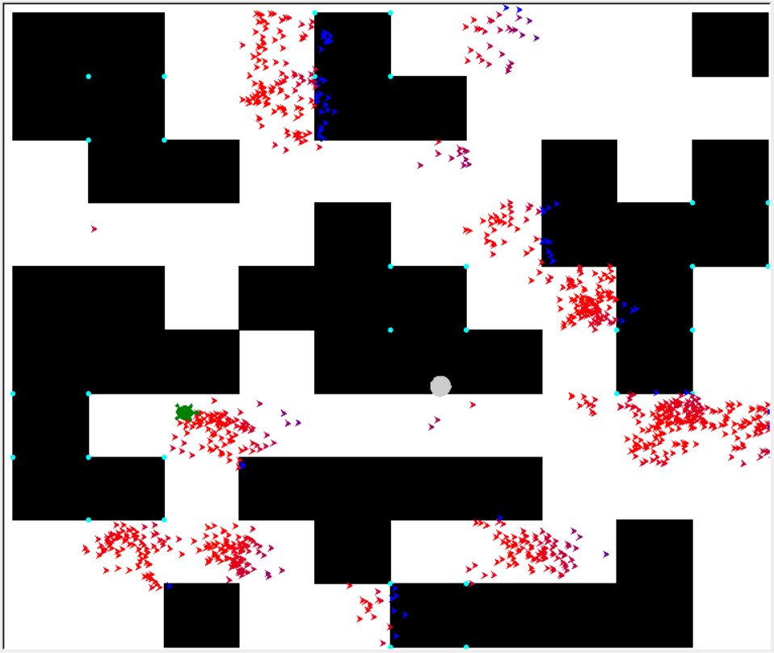

# Homework 5

11510352 李子强

## Problem 1
Given the following observation models, please use importance sampling and resampling techniques to estimate the robot location.

## Problem 2
Given a map and the ultrasound sensor model, please use importance sampling and resampling techniques to estimate the robot location and path.

